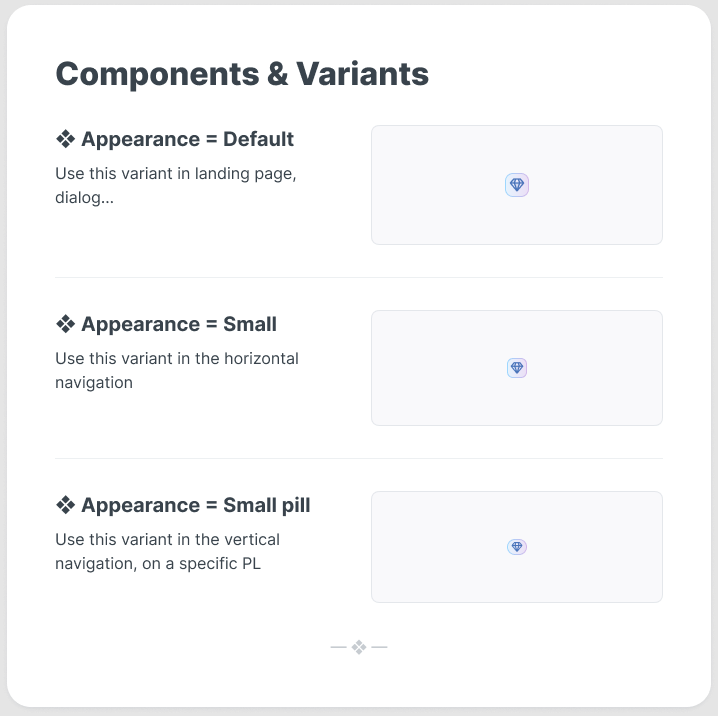

# Components & Variants

## ❖ Appearance = Default

Use this variant in landing page, dialog...

{/* UpsellBadge (Default) images from Figma assets */}

---

## ❖ Appearance = Small

Use this variant in the horizontal navigation

---

## ❖ Appearance = Small pill

Use this variant in the vertical navigation, on a specific PL

---

— ❖ —

---

Notes
- The screenshot placeholder is at `images/figma/components-variants/screenshot.png` — add the exported frame screenshot there or update the image path above.
- The small badge images above are referenced from the Figma asset URLs and will remain valid for a limited time (Figma keeps asset URLs for ~7 days). If you want permanent images, download them and place them in `images/figma/components-variants/` then update the image links.
